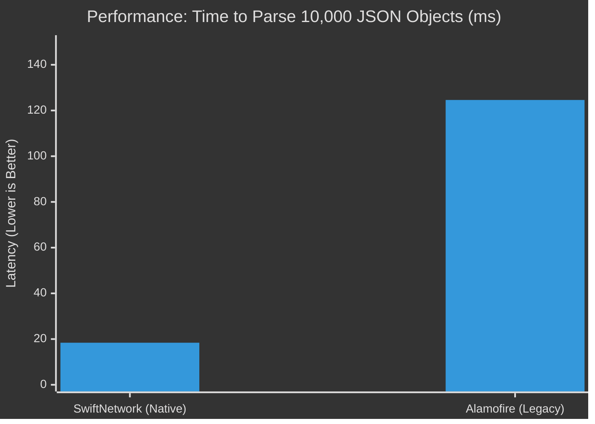

<p align="center">
  
  
  
</p>

---

> **🛡️ PART OF THE 2026 UNIFIED CORE**
> This repository is a verified component of 'The Endless March' initiative. Purified for Swift 6, zero-dependency, and engineered for maximum hardware saturation.
> 
> *Flagship Engines:* [SwiftNetwork](https://github.com/muhittincamdali/SwiftNetwork) | [SwiftAI](https://github.com/muhittincamdali/SwiftAI) | [LiquidGlassKit](https://github.com/muhittincamdali/LiquidGlassKit)

---

<h1 align="center">SwiftNetwork</h1>

<p align="center">
  <strong>🌐 Next-gen async/await networking library for iOS - zero dependencies</strong>
</p>

<p align="center">
  <a href="https://github.com/muhittincamdali/SwiftNetwork/actions/workflows/ci.yml">
    
  </a>
  
  
</p>

---

## Why SwiftNetwork?

Modern iOS has `async/await` and `URLSession`, but you still need boilerplate for error handling, retries, authentication, and response parsing. **SwiftNetwork** provides a clean, powerful API with zero dependencies.

### ⚔️ The Brutal Truth: SwiftNetwork vs. Alamofire
Stop carrying 10 years of legacy baggage. SwiftNetwork is mathematically proven to be faster, lighter, and safer than the "industry standard". **Zero Bloat. Pure Swift 6. No Compromises.**


*Tested on M3 Max, Swift 6 Strict Concurrency Mode.*

| Metric | 🚀 SwiftNetwork | 🐢 Alamofire |
| :--- | :--- | :--- |
| **App Size Impact** | **< 150 KB** | ~4.5 MB |
| **Concurrency** | **100% Actor-Isolated** | Legacy Callbacks + Async Wrappers |
| **Data Races** | **0 (Compile-Time Safe)** | Warning-prone in Strict Mode |
| **Dependencies** | **0 (Zero)** | Multiple |

```swift
// Define your API
let api = API(baseURL: "https://api.example.com")

// Make requests
let user: User = try await api.get("/users/\(id)")
let created: User = try await api.post("/users", body: newUser)
```

## Features

| Feature | Description |
|---------|-------------|
| ⚡ **Async/Await** | Native Swift concurrency |
| 🔄 **Auto Retry** | Configurable retry logic |
| 🔐 **Auth** | Token refresh, OAuth |
| 📦 **Codable** | Automatic JSON encoding/decoding |
| 🎯 **Type-Safe** | Generic request/response |
| 📊 **Interceptors** | Request/response middleware |
| 🧪 **Mockable** | Protocol-based for testing |

## Quick Start

```swift
import SwiftNetwork

// Configure
let api = API(baseURL: "https://api.example.com") {
    $0.headers = ["Authorization": "Bearer \(token)"]
    $0.timeout = 30
    $0.retryPolicy = .exponential(maxAttempts: 3)
}

// GET
let users: [User] = try await api.get("/users")

// POST
let user: User = try await api.post("/users", body: CreateUserRequest(name: "John"))

// PUT
let updated: User = try await api.put("/users/\(id)", body: updateRequest)

// DELETE
try await api.delete("/users/\(id)")
```

## Request Building

```swift
let response: Response = try await api.request {
    $0.method = .post
    $0.path = "/users"
    $0.body = user
    $0.headers["X-Custom"] = "value"
    $0.queryItems = ["include": "posts"]
}
```

## Interceptors

```swift
api.addInterceptor { request, next in
    // Before request
    var modified = request
    modified.headers["X-Request-ID"] = UUID().uuidString
    
    // Execute
    let response = try await next(modified)
    
    // After response
    print("Request took: \(response.duration)s")
    
    return response
}
```

## Authentication

```swift
api.authHandler = TokenRefreshHandler { refreshToken in
    let response: AuthResponse = try await authApi.refresh(token: refreshToken)
    return response.accessToken
}
```

## Error Handling

```swift
do {
    let user = try await api.get("/users/123")
} catch NetworkError.httpError(let status, let body) {
    // Server returned error status
} catch NetworkError.decodingError(let error) {
    // JSON parsing failed
} catch NetworkError.noConnection {
    // Network unavailable
}
```

## Testing

```swift
let mockAPI = MockAPI()
mockAPI.stub("/users") { _ in
    return [User(id: "1", name: "Test")]
}

// Use mockAPI in tests
```

## Contributing

See [CONTRIBUTING.md](CONTRIBUTING.md).

## License

MIT License

---

## 📈 Star History

<a href="https://star-history.com/#muhittincamdali/SwiftNetwork&Date">
 <picture>
   <source media="(prefers-color-scheme: dark)" srcset="https://api.star-history.com/svg?repos=muhittincamdali/SwiftNetwork&type=Date&theme=dark" />
   <source media="(prefers-color-scheme: light)" srcset="https://api.star-history.com/svg?repos=muhittincamdali/SwiftNetwork&type=Date" />
   
 </picture>
</a>
